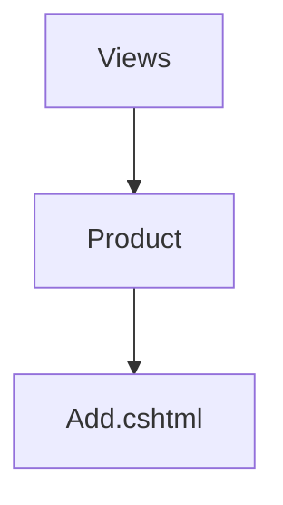

## To create a page
1. Add a controller. ProductController
2. Add an action. Add
3. The final url will be : /[controller]/[action] . For this example, /product/add

```csharp
public class ProductController : Controller
{
  public IActionResult Add()
  {
      return View(); // We should create the view file
  }
}
```
4. The view fille should be created at Views/[controller]/[action.cshtml]


## Sending Data To View from controller action
1. Create a ViewModel with all the required data
2. Send the viewmodel object to the View method.

```csharp
// ProductSearchVm.cs
public class ProductSearchVm
{
  public DateTime CurrentTime; // Sending the current time to view. Just for demo purpose
  public List<Product> Products; // Will send list of products to display in our view
}

// Product.cs
public class Product
{
  public int Id { get; set; }
  public string Name {get;set;}
  public string IsVatEnabled {get;set;}
}

// ProductController.cs -> Search Action

public IActionResult Search()
{
  var vm = new ProductSearchVm();
  vm.CurrentTime = DateTime.Now;
  vm.Products = new List<Product>()
  {
      new Product()
      {
        Id = 1, Name = "Product 1", IsVatEnabled = false
      },
      new Product()
      {
        Id = 2, Name = "Product 2", IsVatEnabled = true
      },
      new Product()
      {
        Id = 3, Name = "Product 3", IsVatEnabled = true
      },
      new Product()
      {
        Id = 4, Name = "Product 4", IsVatEnabled = true
      },
  };
  // We can get the Products from database as well. Using static data for demonstration purpose

  // Now send data to view
  return View(vm);
}

// Views/Product/Search.cshtml
@model ProductSearchVm //We should use the same datatype as that was sent from controller

<!-- Now we can access our data using `Model` variable -->

<h1>
  Current Time: @Model.CurrentTime
</h1>

<table>
  <thead>
    <tr>
      <td> SN </td>
      <td> Name </td>
      <td> Description </td>
      <td> Is Vat Enabled </td>
      <td> Actions </td>
    </tr>
  </thead>
  <tbody>
    @{
      var sn = 1;
      foreach(var item in Model.Products)
      {
          <tr>
            <td> @(sn++) </td>
            <td> @item.Name </td>
            <td> @item.Description </td>
            <td> @item.IsVatEnabled </td>
            <td>
              <a href="/product/edit/@item.Id" class="btn btn-success">
                Edit
              </a>
              <!-- Asp.net core way to render a link -->
              <a asp-controller="Product" asp-action="Edit" asp-route-id="@item.Id" class="btn btn-success">
                Edit
              </a>
            </td>
          </tr>
      }
    }
  </tbody>
</table>


```


## Code and patterns for Search Page

1. Accept a view model in action. The View model must contain properties that the user will provide
2. Perform filtering and get data from database
3. Set the data in the same view model
4. Return the view model to view

Same view model will be used to capture user input as well as display data to user.

```
public IActionResult Index(UnitIndexVm vm)
    {
        // Use dummy data for now
        // Get data from database later
        vm.Data = productUnits
            .Where(x =>
                string.IsNullOrEmpty(vm.Name) || x.Name.Contains(vm.Name)
            ).ToList();
        return View(vm);
    }

// UnitIndexVm.cs
public class UnitIndexVm
{
    // For Retrieving user input
    public string Name { get; set; }

    // Sending data to view
    public List<ProductUnit> Data;
}

// Views/ProductUnit/Index.cshtml

@model bca_vi_august.ViewModels.UnitIndexVm //Using the view model sent from controller action

<!-- Rendering the filter form -->
<form class="card">
    <div class="card-body">
        <div class="row">
            <div class="col-3">
                <label asp-for="Name"></label>
                <input asp-for="Name" type="text" class="form-control">
            </div>
            <div class="col-3">
                <br>
                <button class="btn btn-primary">
                    Search
                </button>
            </div>
        </div>
    </div>
</form>

<!-- Showing data -->
<div class="card mt-2">
    <div class="card-body">
        <table class="table table-striped table-bordered">
            <thead>
            <tr>
                <th>
                    SN
                </th>
                <th>
                    Name
                </th>
                <th>
                    Action
                </th>
            </tr>
            </thead>
            <tbody>
            @{
                var sn = 1;
                foreach (var unit in Model.Data)
                {
                    <tr>
                        <td>
                            @(sn++)
                        </td>
                        <td>
                            @unit.Name
                        </td>
                        <td>
                            <a href="/productunit/edit/@unit.Id" class="btn btn-primary">
                                Edit
                            </a>
                        </td>
                    </tr>
                }
            }
            </tbody>
        </table>
    </div>
</div>


```


