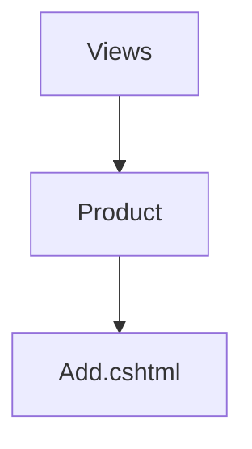

## To create a page
1. Add a controller. ProductController
2. Add an action. Add
3. The final url will be : /[controller]/[action] . For this example, /product/add

```csharp
public class ProductController : Controller
{
  public IActionResult Add()
  {
      return View(); // We should create the view file
  }
}
```
4. The view fille should be created at Views/[controller]/[action.cshtml]

