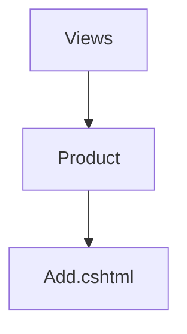

## To create a page
1. Add a controller. ProductController
2. Add an action. Add
3. The final url will be : /[controller]/[action] . For this example, /product/add

```csharp
public class ProductController : Controller
{
  public IActionResult Add()
  {
      return View(); // We should create the view file
  }
}
```
4. The view fille should be created at Views/[controller]/[action.cshtml]


## Sending Data To View from controller action
1. Create a ViewModel with all the required data
2. Send the viewmodel object to the View method.

```csharp
// ProductSearchVm.cs
public class ProductSearchVm
{
  public DateTime CurrentTime; // Sending the current time to view. Just for demo purpose
  public List<Product> Products; // Will send list of products to display in our view
}

// Product.cs
public class Product
{
  public int Id { get; set; }
  public string Name {get;set;}
  public string IsVatEnabled {get;set;}
}

// ProductController.cs -> Search Action

public IActionResult Search()
{
  var vm = new ProductSearchVm();
  vm.CurrentTime = DateTime.Now;
  vm.Products = new List<Product>()
  {
      new Product()
      {
        Id = 1, Name = "Product 1", IsVatEnabled = false
      },
      new Product()
      {
        Id = 2, Name = "Product 2", IsVatEnabled = true
      },
      new Product()
      {
        Id = 3, Name = "Product 3", IsVatEnabled = true
      },
      new Product()
      {
        Id = 4, Name = "Product 4", IsVatEnabled = true
      },
  };
  // We can get the Products from database as well. Using static data for demonstration purpose

  // Now send data to view
  return View(vm);
}

// Views/Product/Search.cshtml
@model ProductSearchVm //We should use the same datatype as that was sent from controller

<!-- Now we can access our data using `Model` variable -->

<h1>
  Current Time: @Model.CurrentTime
</h1>

<table>
  <thead>
    <tr>
      <td> SN </td>
      <td> Name </td>
      <td> Description </td>
      <td> Is Vat Enabled </td>
      <td> Actions </td>
    </tr>
  </thead>
  <tbody>
    @{
      var sn = 1;
      foreach(var item in Model.Products)
      {
          <tr>
            <td> @(sn++) </td>
            <td> @item.Name </td>
            <td> @item.Description </td>
            <td> @item.IsVatEnabled </td>
            <td>
              <a href="/product/edit/@item.Id" class="btn btn-success">
                Edit
              </a>
              <!-- Asp.net core way to render a link -->
              <a asp-controller="Product" asp-action="Edit" asp-route-id="@item.Id" class="btn btn-success">
                Edit
              </a>
            </td>
          </tr>
      }
    }
  </tbody>
</table>


```


## Code and patterns for Search Page

1. Accept a view model in action. The View model must contain properties that the user will provide
2. Perform filtering and get data from database
3. Set the data in the same view model
4. Return the view model to view

Same view model will be used to capture user input as well as display data to user.

```csharp
public IActionResult Index(UnitIndexVm vm)
    {
        // Use dummy data for now
        // Get data from database later
        vm.Data = productUnits
            .Where(x =>
                string.IsNullOrEmpty(vm.Name) || x.Name.Contains(vm.Name)
            ).ToList();
        return View(vm);
    }

// UnitIndexVm.cs
public class UnitIndexVm
{
    // For Retrieving user input
    public string Name { get; set; }

    // Sending data to view
    public List<ProductUnit> Data;
}

// Views/ProductUnit/Index.cshtml

@model bca_vi_august.ViewModels.UnitIndexVm //Using the view model sent from controller action

<!-- Rendering the filter form -->
<form class="card">
    <div class="card-body">
        <div class="row">
            <div class="col-3">
                <label asp-for="Name"></label>
                <input asp-for="Name" type="text" class="form-control">
            </div>
            <div class="col-3">
                <br>
                <button class="btn btn-primary">
                    Search
                </button>
            </div>
        </div>
    </div>
</form>

<!-- Showing data -->
<div class="card mt-2">
    <div class="card-body">
        <table class="table table-striped table-bordered">
            <thead>
            <tr>
                <th>
                    SN
                </th>
                <th>
                    Name
                </th>
                <th>
                    Action
                </th>
            </tr>
            </thead>
            <tbody>
            @{
                var sn = 1;
                foreach (var unit in Model.Data)
                {
                    <tr>
                        <td>
                            @(sn++)
                        </td>
                        <td>
                            @unit.Name
                        </td>
                        <td>
                            <a href="/productunit/edit/@unit.Id" class="btn btn-primary">
                                Edit
                            </a>
                        </td>
                    </tr>
                }
            }
            </tbody>
        </table>
    </div>
</div>


```


## Edit Pattern

1. A controller action for displaying the edit form
2. Validate that the data exists
3. Show data in the form

   1.1. Another action for actually updating user data
   1.2  Validate user input data [Model state validation
   1.3  Update data in databse
   1.4 Redirect user to another page

 ```csharp

// Form Action

// Accepting the id of the item to edit. User will access this action through a link
// Potential link : <a asp-action="Edit" asp-route-id="@unit.Id"> Edit </a> or <a href="/productunit/edit/@unit.id"> Edit </a>
public IActionResult Edit(int id)
{
    // To edit
    // 1. Identifier to identify data : ID
    // 2. Validate that the item exists
    // 3. Get the data and display the data in the form
    try
    {
        // Getting data from database. Currently using local data
        var item = productUnits.Where(x => x.Id == id)
            .FirstOrDefault();
        if (item == null)
        {
            throw new Exception("Item not found");
        }
        // ViewModel
       //  Setting data from database (model) into view model. To show the data in the edit form  
        var vm = new UnitEditVm();
        vm.Name = item.Name;
        vm.Description = item.Name;
        // Send the view model to view. This data will be used to show edit form
        return View(vm);
    }
    catch (Exception e)
    {
        // Send error message
        // If any error occurs, we redirect to the listing page with an error page
        return RedirectToAction("Index");
    }
}

// Action that will actuall update data
// Using a Viewmodel in parameter to perform model binding.
// The data user input will be filled by ASP.NET core in the view model
[HttpPost]
public IActionResult Edit(int id, UnitEditVm vm)
{
    try
    {
        var item = productUnits.Where(x => x.Id == id)
            .FirstOrDefault();
        if (item == null)
        {
            throw new Exception("Item not found");
        }

        if (!ModelState.IsValid)
        {
            // If user did not enter valid data, show the form again so that user can fix their mistake
            return View(vm);
        }
        // Update data in database. Updating data locally for now
        // The changes wont show up in view
        item.Name = vm.Name;
        // Save Changes
        // Send Success Message
        return RedirectToAction("Index");
    }
    catch (Exception e)
    {
        // Send error message
        return RedirectToAction("Index");
    }
}
```


### Database
Database

	-> Access -> Data Access Object
		-> Ef Core -- Standard data access library
			-> Entity Framework Core
			-> ORM - Object Relational Mapper
				-> Laravel - Eloquent
				-> Node -> TypeORM
				-> PHP -> Doctrine
			-> Access to database without SQL query
				-> Via Linq operators
					-> Pros
						-> No sql query
						-> No Database lockin
							-> Driver Libraries / Helper libraries
								-> psql -> npgsql
								-> sql server -> sqlserver
								-> Connection String
			-> Modify database without SQL query
				-> DML - Via object manipulation
				-> DDL - Via migration
					-> Create new migration
					-> Apply
--

Database Context
	-- Application Db Context
		-> Define Models - Define Tables
	-- Migration
		-> Run a command to create migration
		-> 1. Manually run migration via command
		-> 2. Automatically run migration when program runs
	
	-- Saving data and retrieving data
	-- Generic Repository
	-- UOW -- Depends

-- Process
1. How to create a table?
	- Create a model.
		[Table("inv_product")]
		public class Product
		{
			// Define properties/Columns
			public int Id { get;set; }
			public int CategoryId { get;set; }
			public string Name { get;set; }
			public bool IsVatEnabled { get;set; }
			public DateTime CreatedDate { get;set; }
		}
		
		| Id int primary key auto increment not null
		| CategoryId int
		| Name varchar text
		| IsVatEnabled bit -- sql server bool -- psql
		| CreatedDate DATETIME -- SQL SERVER  timestampz --psql
	- Register it in database context
		In ApplicationDbContext, add a dbset property
		
		public DbSet<Product> Products { get;set; }
	
	- Add a migration
		-> In project folder, open a terminal
		-> If dotnet ef tools is not installed, install it
			-- https://learn.microsoft.com/en-us/ef/core/cli/dotnet#installing-the-tools
		-> dotnet ef migrations add "migration_name"
			-- dotnet ef migrations add "add_product"
			-- Creates a migration file
	- Run migration

2. Add / alter column
	// Add a CreatedByUserId column to product table
		[Table("inv_product")]
		public class Product
		{
			// Define properties/Columns
			public int Id { get;set; }
			public int CategoryId { get;set; }
			public string Name { get;set; }
			public bool IsVatEnabled { get;set; }
			
			// public DateTime CreatedDate { get;set; }
			
			// Add this line
			public int CreatedByUserId {get;set;}
		}
	-- Error: Column 'CreatedByUserId' not found
	-- Add migration
		- dotnet ef migrations add "remove_created_date_adD_created"
	-- Run migration
	

-- Steps
1. Use Database library. UseSqlServer
2. Add connection string
3. Add table and migration
4. Run migration
	- manually - dotnet ef database update
	- Update
		- Add this to program.cs after  var app = builder.Build();
		app.Services.CreateScope().ServiceProvider.GetService<DbContext>().Database.Migrate();


	-- Tomorrow
		-> Linq operation
			-> LINQ -> Data access 
				-> Write C# code to filter data
					-> EfCore converts it into SQL statements
		-> Redirects
		-> Relationships
		-> Select options
		
	-- C# Best Feature
		- Type Safety
		
		<?php echo $data["none"]; ?>
		-- Error
		
		C#
		@Model.Index	

			// Always start with DbContext
			// Get Variable of the data we want DbSet<Product> Products {get;set;}
			
			// SELECT * FROM product WHERE Id = 1

			1. Where
			2. Actual data retrieve
			
SELECT * FROM product WHERE Id = 9;

_context.Products.Where(x => x.Id == 9)
	.ToListAsync();

SELECT * FROM product WHERE CategoryId = 9 AND Status = 'ACTIVE'
	AND (isVat = false OR noVat = true);
	
var data = await _context.Products.Where(x => x.CategoryId == 9)
	.Where(x => x.Status == 'ACTIVE')
	.Where(x => x.isVat == false || x.noVat == true)
	.ToListAsync();
	

Methods
	- ToListAsync -> Executes query and get list of items
	- FirstOrDefaultAsync() -> Execute the query and get the first data
		-> To Get Single Data


// Redirect
header("Location: /product/index.php");
